# flutter-firebase
Praktikum Flutter Firebase

## Get the sample code
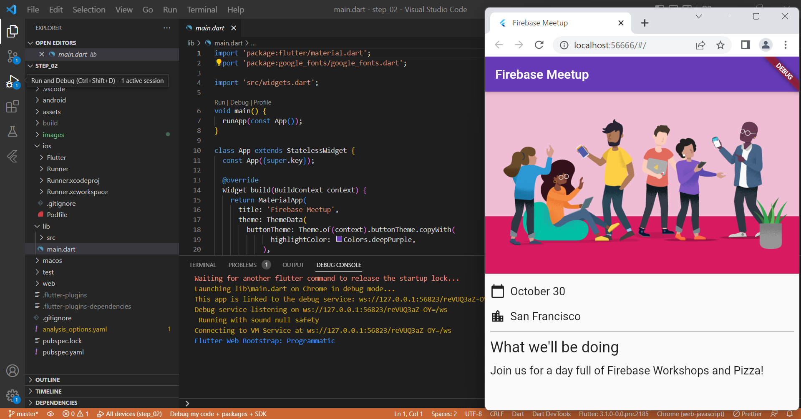

## Create a Firebase project
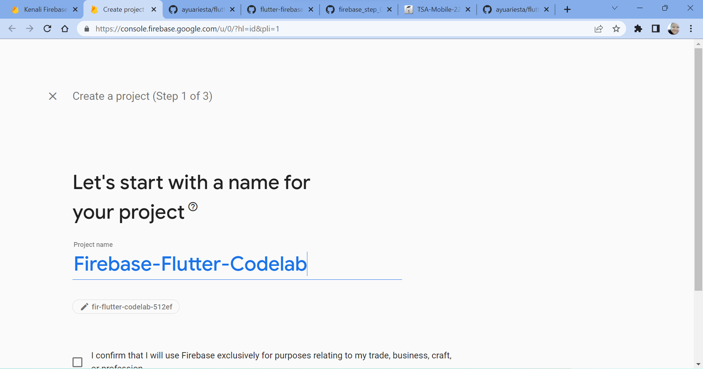

## Enable email sign-in for Firebase Authentication
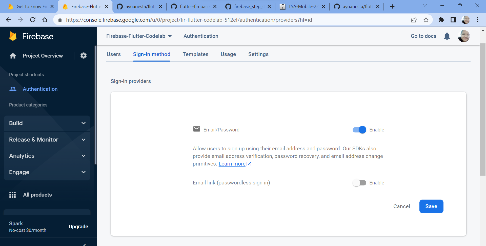

## Enable Cloud Firestore
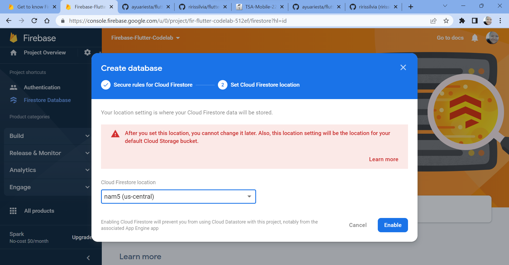

## Configure dependencies
```
flutter pub add firebase_core 
```
firebase_core adalah kode umum yang diperlukan untuk semua plugin Firebase Flutter.

```
flutter pub add firebase_auth
```
firebase_auth memungkinkan integrasi dengan kemampuan Otentikasi Firebase.
```
flutter pub add cloud_firestore
```
cloud_firestore memungkinkan akses ke penyimpanan data Cloud Firestore.
```
flutter pub add provider
```
menggunakan paket provider yang akan memungkinkan pemisahan logika bisnis dari logika tampilan.

## Install Flutterfire
```
dart pub global activate flutterfire_cli
```

## Configure apps
```
flutterfire configure
```

## Add user sign-in (RSVP)
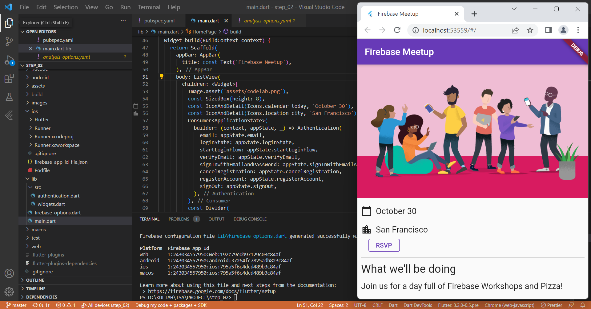

## Login menggunakan email
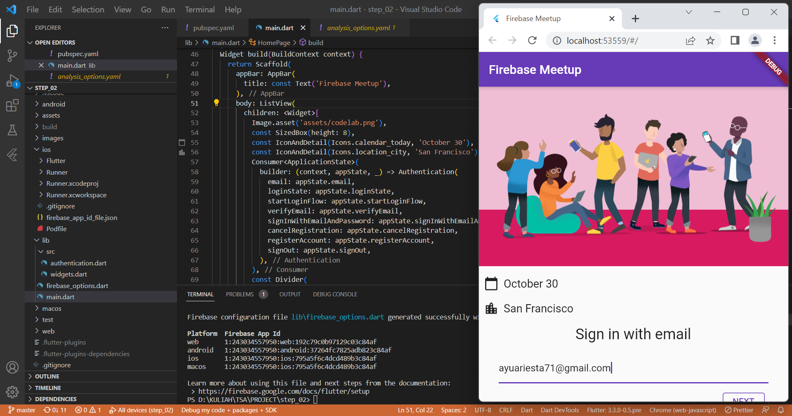

## Create Account
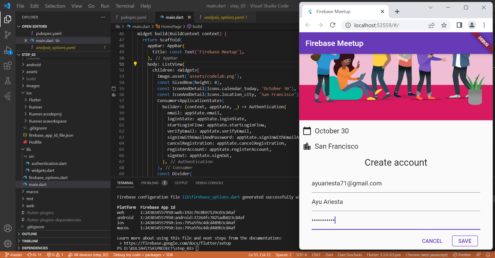

## Tampilan saat sudah login
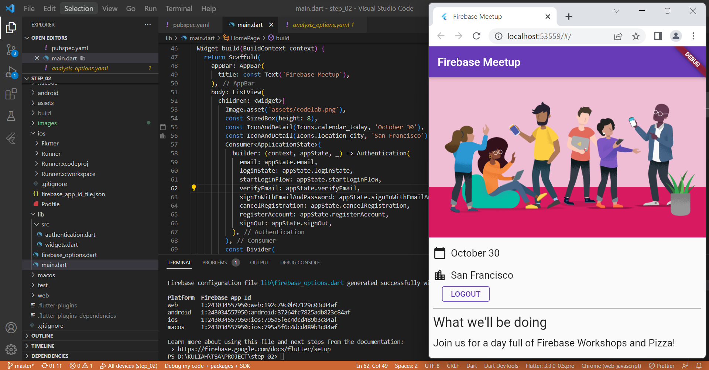

## Write messages to Cloud Firestore
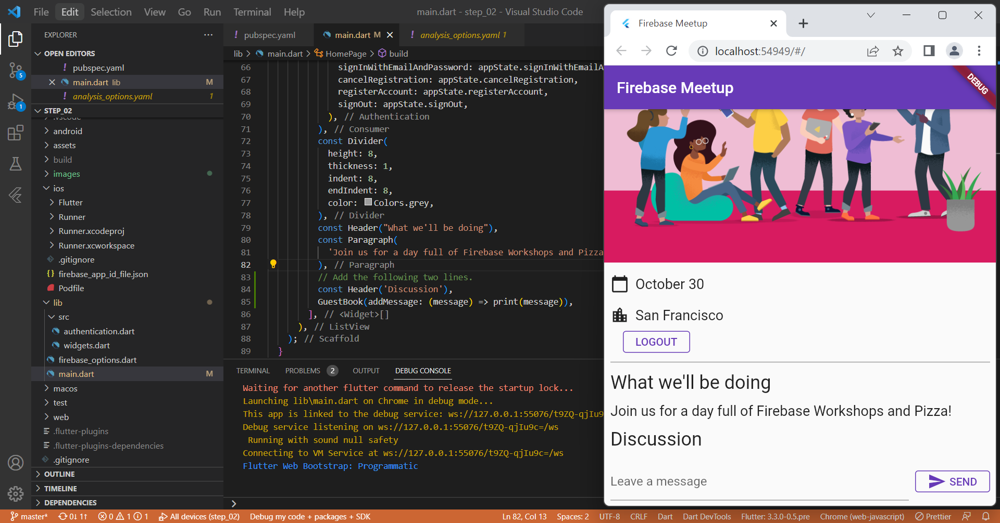

## Tampilan Cloud Firestore saat user mengirim pesan
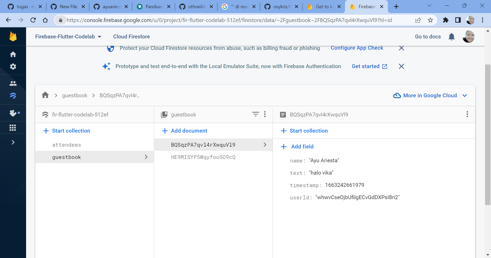

## Read messages
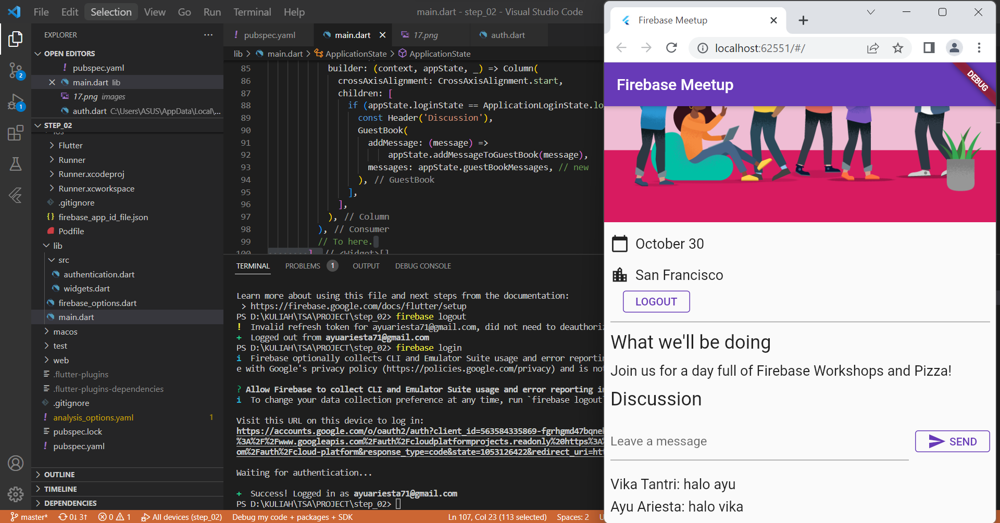

## Add validation rules
```
rules_version = '2';
service cloud.firestore {
  match /databases/{database}/documents {
    match /guestbook/{entry} {
      allow read: if request.auth.uid != null;
      allow write:
      if request.auth.uid == request.resource.data.userId
          && "name" in request.resource.data
          && "text" in request.resource.data
          && "timestamp" in request.resource.data;
    }
  }
}
```

## Status RSVP Pengguna
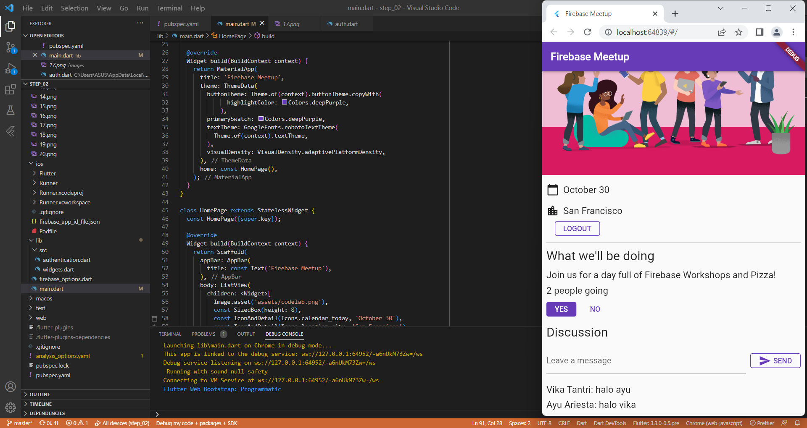

## Add validation rules
```
rules_version = '2';
service cloud.firestore {
  match /databases/{database}/documents {
    match /guestbook/{entry} {
      allow read: if request.auth.uid != null;
      allow write:
      if request.auth.uid == request.resource.data.userId
          && "name" in request.resource.data
          && "text" in request.resource.data
          && "timestamp" in request.resource.data;
    }
    match /attendees/{userId} {
      allow read: if true;
      allow write: if request.auth.uid == userId
          && "attending" in request.resource.data;

    }
  }
}
```
